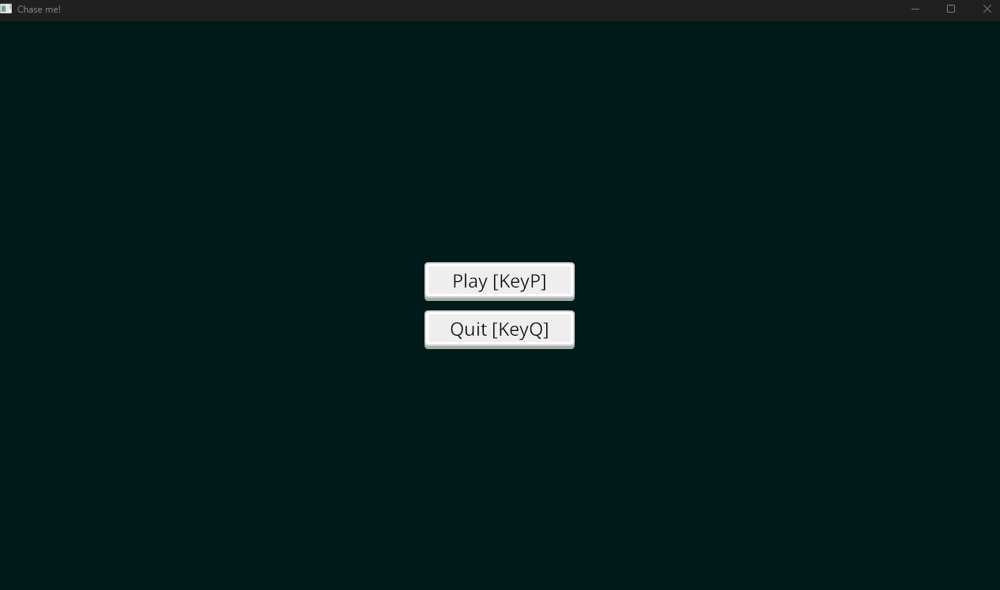

# bevy game exploration

Requirements:

```sh
# install rust
curl --proto '=https' --tlsv1.2 -sSf https://sh.rustup.rs | sh
```

First compile of Bevy projects is slow, but after that its fast.

## Progress

Move with momentum


